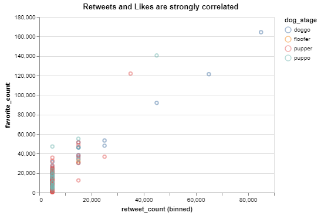
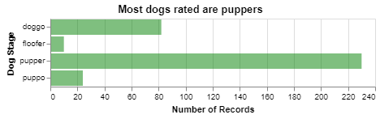
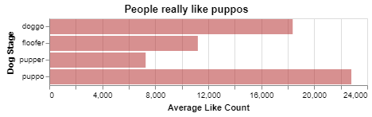
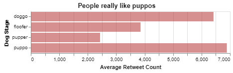
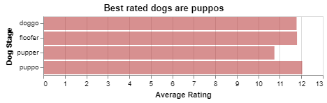
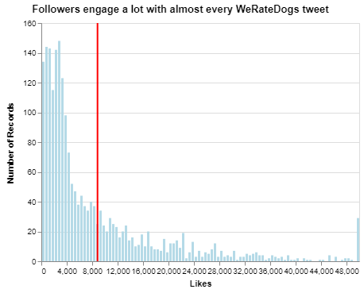
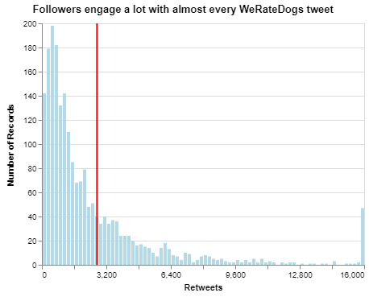

# WeRateDogs
#### A Data-Wrangling project by Bernardo Romero as part of Udacity's Data Analysis Nanodegree - DAND

## Table of Contents
<ul>
<li><a href="#intro">Introduction</a></li>
<li><a href="#gather">Gather Data</a></li>
<li><a href="#assess">Assess the Data</a></li>
<li><a href="#clean">Clean the Data</a></li>
<li><a href="#analysis">Analysis</a></li>
<li><a href="#conclusion">Conclusions</a></li></ul>

<a id='intro'></a>
## Introduction

This project makes part of the coursework leading to Udacity's Data Analysis Nanodegree (DAND). Its objective is to demonstrate skills for the Data Wrangling phase of the Data Analysis Process. Data Wrangling is a key part in analytics, and is typically described as the one where analysts and data scientists spend the most part of their time.

The project gathers data from different sources related to the WeRateDogs twitter account, which posts and rates photos of folowers' dogs. After assessing and cleaning the data, reports are written to communicate the results of an initial analysis. 


```python
# Import the required packages

import pandas as pd
import tweepy as tw
import requests
import json
import os
```

<a id='gather'></a>
## Gather

The first step of the wrangling process is to obtain data. For this project, we will work with different sources:
- a file in hand with data about each tweet by WeRateDogs, provided by Udacity
- a file downloaded programatically, with breed predictions for each dog
- additional data about each tweet (retweets and fav's), retrieved from Twitter's API

**Import a File on hand into a padas dataframe**


```python
# Import file with twitter posts as a pandas dataframe
feed = pd.read_csv('twitter-archive-enhanced.csv', sep =',')
```

**Dowload a file from the Internet programatically**


```python
# Programatically download the datafile with breed predictions based on the tweet's image from a URL to insure reproducibility
url = 'https://d17h27t6h515a5.cloudfront.net/topher/2017/August/599fd2ad_image-predictions/image-predictions.tsv'
response = requests.get(url)
with open(os.path.join(url.split('/')[-1]), mode='wb') as file:
        file.write(response.content)
        
predictions = pd.read_csv('image-predictions.tsv', sep='\t')
```

**Retrieve additional data from Twitter APIs, for each of the tweets in `twitter-archive-enhanced.csv`**

Each tweet's retweet count and favorite ("like") count at minimum, and any additional data you find interesting. Using the tweet IDs in the WeRateDogs Twitter archive, query the Twitter API for each tweet's JSON data using Python's Tweepy library and store each tweet's entire set of JSON data in a file called tweet_json.txt file. Each tweet's JSON data should be written to its own line. Then read this .txt file line by line into a pandas DataFrame with (at minimum) tweet ID, retweet count, and favorite count.


```python
# Twitter keys (delete before sharing)
consumer_key=""
consumer_secret=""
access_token=""
access_token_secret=""
```


```python
# query the Twitter API for each tweet's JSON data using Python's Tweepy
auth = tw.OAuthHandler(consumer_key, consumer_secret)
auth.set_access_token(access_token, access_token_secret)

api = tw.API(auth, wait_on_rate_limit = True, wait_on_rate_limit_notify = True)
```


```python
# Dataframe with the tweet ids in twitter_archive-enhanced.csv
tweet_ids = feed.tweet_id
```


```python
# retrieve the full JSON for the status of each id in twitter-archive-enhanced.csv
# This script takes over 35 minutes to run
failed_id = []
with open('tweet_json.txt', 'w', encoding='UTF-8') as json_file:
    for id_ in tweet_ids:
        try:
            tweet = api.get_status(id_)
            tweet = tweet._json
            json.dump(tweet, json_file)
            json_file.write('\n')
        except:
            print('Failed retrieving tweet with id ',id_)
            failed_id.append(id_)
    
```

    Failed retrieving tweet with id  888202515573088257
    Failed retrieving tweet with id  873697596434513921
    Failed retrieving tweet with id  872668790621863937
    Failed retrieving tweet with id  869988702071779329
    Failed retrieving tweet with id  866816280283807744
    Failed retrieving tweet with id  861769973181624320
    Failed retrieving tweet with id  845459076796616705
    Failed retrieving tweet with id  842892208864923648
    Failed retrieving tweet with id  837012587749474308
    Failed retrieving tweet with id  827228250799742977
    Failed retrieving tweet with id  812747805718642688
    Failed retrieving tweet with id  802247111496568832
    Failed retrieving tweet with id  775096608509886464
    Failed retrieving tweet with id  770743923962707968
    

    Rate limit reached. Sleeping for: 400
    

    Failed retrieving tweet with id  754011816964026368
    Failed retrieving tweet with id  680055455951884288
    

    Rate limit reached. Sleeping for: 438
    


```python
# Read the contents of the created file and create a dataframe with the fields of interest 

df = []
with open('tweet_json.txt') as f:
    for line in f:
        tweet = (json.loads(line))
        tweet_id = tweet['id']
        retweet_count = tweet['retweet_count']
        favorite_count = tweet['favorite_count']
        create_date = tweet['created_at']
        df.append({'retweet_count' : retweet_count,
                  'favorite_count' : favorite_count,
                  'create_date' : create_date,
                  'tweet_id' : tweet_id})
        
more_data = pd.DataFrame(df, columns = ['tweet_id', 'retweet_count', 'favorite_count', 'create_date'])
```

<a id='assess'></a>
## Assess

Assessing is the process of checking the data sets for two things: **quality issues** and lack of **tidiness**. Data that has quality issues has problems with its contents: missing, corrupted, inacurate, duplicate or incorrect data. This is called "dirty data". In the contrary, "untidy" or "messy" data has specific structural issues. 

You look for these issues in two ways: visually and programatically. When you detect an issue you document it, to make cleaning easier. You don't write yet how to clean the data, but only state the observation.


**Visual assessment** is great for getting acquainted with the data and understanding what it is all about. That's what we will do now:


```python
# assessing the file with the retrieved data for WeRateDogs tweets
feed.head()
```


<div>
<style scoped>
    .dataframe tbody tr th:only-of-type {
        vertical-align: middle;
    }

    .dataframe tbody tr th {
        vertical-align: top;
    }

    .dataframe thead th {
        text-align: right;
    }
</style>
<table border="1" class="dataframe">
  <thead>
    <tr style="text-align: right;">
      <th></th>
      <th>tweet_id</th>
      <th>in_reply_to_status_id</th>
      <th>in_reply_to_user_id</th>
      <th>timestamp</th>
      <th>source</th>
      <th>text</th>
      <th>retweeted_status_id</th>
      <th>retweeted_status_user_id</th>
      <th>retweeted_status_timestamp</th>
      <th>expanded_urls</th>
      <th>rating_numerator</th>
      <th>rating_denominator</th>
      <th>name</th>
      <th>doggo</th>
      <th>floofer</th>
      <th>pupper</th>
      <th>puppo</th>
    </tr>
  </thead>
  <tbody>
    <tr>
      <th>0</th>
      <td>892420643555336193</td>
      <td>NaN</td>
      <td>NaN</td>
      <td>2017-08-01 16:23:56 +0000</td>
      <td>&lt;a href="http://twitter.com/download/iphone" r...</td>
      <td>This is Phineas. He's a mystical boy. Only eve...</td>
      <td>NaN</td>
      <td>NaN</td>
      <td>NaN</td>
      <td>https://twitter.com/dog_rates/status/892420643...</td>
      <td>13</td>
      <td>10</td>
      <td>Phineas</td>
      <td>None</td>
      <td>None</td>
      <td>None</td>
      <td>None</td>
    </tr>
    <tr>
      <th>1</th>
      <td>892177421306343426</td>
      <td>NaN</td>
      <td>NaN</td>
      <td>2017-08-01 00:17:27 +0000</td>
      <td>&lt;a href="http://twitter.com/download/iphone" r...</td>
      <td>This is Tilly. She's just checking pup on you....</td>
      <td>NaN</td>
      <td>NaN</td>
      <td>NaN</td>
      <td>https://twitter.com/dog_rates/status/892177421...</td>
      <td>13</td>
      <td>10</td>
      <td>Tilly</td>
      <td>None</td>
      <td>None</td>
      <td>None</td>
      <td>None</td>
    </tr>
    <tr>
      <th>2</th>
      <td>891815181378084864</td>
      <td>NaN</td>
      <td>NaN</td>
      <td>2017-07-31 00:18:03 +0000</td>
      <td>&lt;a href="http://twitter.com/download/iphone" r...</td>
      <td>This is Archie. He is a rare Norwegian Pouncin...</td>
      <td>NaN</td>
      <td>NaN</td>
      <td>NaN</td>
      <td>https://twitter.com/dog_rates/status/891815181...</td>
      <td>12</td>
      <td>10</td>
      <td>Archie</td>
      <td>None</td>
      <td>None</td>
      <td>None</td>
      <td>None</td>
    </tr>
    <tr>
      <th>3</th>
      <td>891689557279858688</td>
      <td>NaN</td>
      <td>NaN</td>
      <td>2017-07-30 15:58:51 +0000</td>
      <td>&lt;a href="http://twitter.com/download/iphone" r...</td>
      <td>This is Darla. She commenced a snooze mid meal...</td>
      <td>NaN</td>
      <td>NaN</td>
      <td>NaN</td>
      <td>https://twitter.com/dog_rates/status/891689557...</td>
      <td>13</td>
      <td>10</td>
      <td>Darla</td>
      <td>None</td>
      <td>None</td>
      <td>None</td>
      <td>None</td>
    </tr>
    <tr>
      <th>4</th>
      <td>891327558926688256</td>
      <td>NaN</td>
      <td>NaN</td>
      <td>2017-07-29 16:00:24 +0000</td>
      <td>&lt;a href="http://twitter.com/download/iphone" r...</td>
      <td>This is Franklin. He would like you to stop ca...</td>
      <td>NaN</td>
      <td>NaN</td>
      <td>NaN</td>
      <td>https://twitter.com/dog_rates/status/891327558...</td>
      <td>12</td>
      <td>10</td>
      <td>Franklin</td>
      <td>None</td>
      <td>None</td>
      <td>None</td>
      <td>None</td>
    </tr>
  </tbody>
</table>
</div>


```python
# assessing the file with the breed predictions for each dog
predictions.head()
```


<div>
<style scoped>
    .dataframe tbody tr th:only-of-type {
        vertical-align: middle;
    }

    .dataframe tbody tr th {
        vertical-align: top;
    }

    .dataframe thead th {
        text-align: right;
    }
</style>
<table border="1" class="dataframe">
  <thead>
    <tr style="text-align: right;">
      <th></th>
      <th>tweet_id</th>
      <th>jpg_url</th>
      <th>img_num</th>
      <th>p1</th>
      <th>p1_conf</th>
      <th>p1_dog</th>
      <th>p2</th>
      <th>p2_conf</th>
      <th>p2_dog</th>
      <th>p3</th>
      <th>p3_conf</th>
      <th>p3_dog</th>
    </tr>
  </thead>
  <tbody>
    <tr>
      <th>0</th>
      <td>666020888022790149</td>
      <td>https://pbs.twimg.com/media/CT4udn0WwAA0aMy.jpg</td>
      <td>1</td>
      <td>Welsh_springer_spaniel</td>
      <td>0.465074</td>
      <td>True</td>
      <td>collie</td>
      <td>0.156665</td>
      <td>True</td>
      <td>Shetland_sheepdog</td>
      <td>0.061428</td>
      <td>True</td>
    </tr>
    <tr>
      <th>1</th>
      <td>666029285002620928</td>
      <td>https://pbs.twimg.com/media/CT42GRgUYAA5iDo.jpg</td>
      <td>1</td>
      <td>redbone</td>
      <td>0.506826</td>
      <td>True</td>
      <td>miniature_pinscher</td>
      <td>0.074192</td>
      <td>True</td>
      <td>Rhodesian_ridgeback</td>
      <td>0.072010</td>
      <td>True</td>
    </tr>
    <tr>
      <th>2</th>
      <td>666033412701032449</td>
      <td>https://pbs.twimg.com/media/CT4521TWwAEvMyu.jpg</td>
      <td>1</td>
      <td>German_shepherd</td>
      <td>0.596461</td>
      <td>True</td>
      <td>malinois</td>
      <td>0.138584</td>
      <td>True</td>
      <td>bloodhound</td>
      <td>0.116197</td>
      <td>True</td>
    </tr>
    <tr>
      <th>3</th>
      <td>666044226329800704</td>
      <td>https://pbs.twimg.com/media/CT5Dr8HUEAA-lEu.jpg</td>
      <td>1</td>
      <td>Rhodesian_ridgeback</td>
      <td>0.408143</td>
      <td>True</td>
      <td>redbone</td>
      <td>0.360687</td>
      <td>True</td>
      <td>miniature_pinscher</td>
      <td>0.222752</td>
      <td>True</td>
    </tr>
    <tr>
      <th>4</th>
      <td>666049248165822465</td>
      <td>https://pbs.twimg.com/media/CT5IQmsXIAAKY4A.jpg</td>
      <td>1</td>
      <td>miniature_pinscher</td>
      <td>0.560311</td>
      <td>True</td>
      <td>Rottweiler</td>
      <td>0.243682</td>
      <td>True</td>
      <td>Doberman</td>
      <td>0.154629</td>
      <td>True</td>
    </tr>
  </tbody>
</table>
</div>


```python
more_data.head()
```


<div>
<style scoped>
    .dataframe tbody tr th:only-of-type {
        vertical-align: middle;
    }

    .dataframe tbody tr th {
        vertical-align: top;
    }

    .dataframe thead th {
        text-align: right;
    }
</style>
<table border="1" class="dataframe">
  <thead>
    <tr style="text-align: right;">
      <th></th>
      <th>tweet_id</th>
      <th>retweet_count</th>
      <th>favorite_count</th>
      <th>create_date</th>
    </tr>
  </thead>
  <tbody>
    <tr>
      <th>0</th>
      <td>892420643555336193</td>
      <td>8323</td>
      <td>38047</td>
      <td>Tue Aug 01 16:23:56 +0000 2017</td>
    </tr>
    <tr>
      <th>1</th>
      <td>892177421306343426</td>
      <td>6149</td>
      <td>32665</td>
      <td>Tue Aug 01 00:17:27 +0000 2017</td>
    </tr>
    <tr>
      <th>2</th>
      <td>891815181378084864</td>
      <td>4069</td>
      <td>24579</td>
      <td>Mon Jul 31 00:18:03 +0000 2017</td>
    </tr>
    <tr>
      <th>3</th>
      <td>891689557279858688</td>
      <td>8469</td>
      <td>41402</td>
      <td>Sun Jul 30 15:58:51 +0000 2017</td>
    </tr>
    <tr>
      <th>4</th>
      <td>891327558926688256</td>
      <td>9164</td>
      <td>39579</td>
      <td>Sat Jul 29 16:00:24 +0000 2017</td>
    </tr>
  </tbody>
</table>
</div>


#### Programatical Assessment
After assessing visually the three datasets and identifying several tidiness issues, we now go deeper using Programatic Assessment:


```python
feed.info()
```

    <class 'pandas.core.frame.DataFrame'>
    RangeIndex: 2356 entries, 0 to 2355
    Data columns (total 17 columns):
    tweet_id                      2356 non-null int64
    in_reply_to_status_id         78 non-null float64
    in_reply_to_user_id           78 non-null float64
    timestamp                     2356 non-null object
    source                        2356 non-null object
    text                          2356 non-null object
    retweeted_status_id           181 non-null float64
    retweeted_status_user_id      181 non-null float64
    retweeted_status_timestamp    181 non-null object
    expanded_urls                 2297 non-null object
    rating_numerator              2356 non-null int64
    rating_denominator            2356 non-null int64
    name                          2356 non-null object
    doggo                         2356 non-null object
    floofer                       2356 non-null object
    pupper                        2356 non-null object
    puppo                         2356 non-null object
    dtypes: float64(4), int64(3), object(10)
    memory usage: 313.0+ KB
    

The missing data for retweets and replies is fine, since we are not interested in those. 59 expanded URLs are missing. 


```python
predictions.info()
```

    <class 'pandas.core.frame.DataFrame'>
    RangeIndex: 2075 entries, 0 to 2074
    Data columns (total 12 columns):
    tweet_id    2075 non-null int64
    jpg_url     2075 non-null object
    img_num     2075 non-null int64
    p1          2075 non-null object
    p1_conf     2075 non-null float64
    p1_dog      2075 non-null bool
    p2          2075 non-null object
    p2_conf     2075 non-null float64
    p2_dog      2075 non-null bool
    p3          2075 non-null object
    p3_conf     2075 non-null float64
    p3_dog      2075 non-null bool
    dtypes: bool(3), float64(3), int64(2), object(4)
    memory usage: 152.1+ KB
    


```python
more_data.info()
```

    <class 'pandas.core.frame.DataFrame'>
    RangeIndex: 2340 entries, 0 to 2339
    Data columns (total 4 columns):
    tweet_id          2340 non-null int64
    retweet_count     2340 non-null int64
    favorite_count    2340 non-null int64
    create_date       2340 non-null object
    dtypes: int64(3), object(1)
    memory usage: 73.2+ KB
    


```python
# We test whether the missing expanded URLs are a problem.
# If there is a link in the tweet's text and no expanded URL then there is an issue

explore = feed[feed['expanded_urls'].isnull()]
explore['text'].str.contains('http').sum()
```


    0


No issue there. Every tweet with an url has an expanded URL. Those without one are usually retweets or replies.


```python
# value counts for the source column
feed.source.value_counts()
```


    <a href="http://twitter.com/download/iphone" rel="nofollow">Twitter for iPhone</a>     2221
    <a href="http://vine.co" rel="nofollow">Vine - Make a Scene</a>                          91
    <a href="http://twitter.com" rel="nofollow">Twitter Web Client</a>                       33
    <a href="https://about.twitter.com/products/tweetdeck" rel="nofollow">TweetDeck</a>      11
    Name: source, dtype: int64


```python
# every numerator not other than 10-14 in the dogs rating is a possible quality issue
feed.rating_numerator.value_counts().sort_index(ascending=False)
```


    1776      1
    960       1
    666       1
    420       2
    204       1
    182       1
    165       1
    144       1
    143       1
    121       1
    99        1
    88        1
    84        1
    80        1
    75        2
    60        1
    50        1
    45        1
    44        1
    27        1
    26        1
    24        1
    20        1
    17        1
    15        2
    14       54
    13      351
    12      558
    11      464
    10      461
    9       158
    8       102
    7        55
    6        32
    5        37
    4        17
    3        19
    2         9
    1         9
    0         2
    Name: rating_numerator, dtype: int64


```python
# every denominator not equal to 10 in the dogs rating is a possible quality issue
feed.rating_denominator.value_counts().sort_index(ascending=False)
```


    170       1
    150       1
    130       1
    120       1
    110       1
    90        1
    80        2
    70        1
    50        3
    40        1
    20        2
    16        1
    15        1
    11        3
    10     2333
    7         1
    2         1
    0         1
    Name: rating_denominator, dtype: int64


```python
# we check for duplicated IDs in the feeds dataframe
feed[feed.tweet_id.duplicated()]
```


<div>
<style scoped>
    .dataframe tbody tr th:only-of-type {
        vertical-align: middle;
    }

    .dataframe tbody tr th {
        vertical-align: top;
    }

    .dataframe thead th {
        text-align: right;
    }
</style>
<table border="1" class="dataframe">
  <thead>
    <tr style="text-align: right;">
      <th></th>
      <th>tweet_id</th>
      <th>in_reply_to_status_id</th>
      <th>in_reply_to_user_id</th>
      <th>timestamp</th>
      <th>source</th>
      <th>text</th>
      <th>retweeted_status_id</th>
      <th>retweeted_status_user_id</th>
      <th>retweeted_status_timestamp</th>
      <th>expanded_urls</th>
      <th>rating_numerator</th>
      <th>rating_denominator</th>
      <th>name</th>
      <th>doggo</th>
      <th>floofer</th>
      <th>pupper</th>
      <th>puppo</th>
    </tr>
  </thead>
  <tbody>
  </tbody>
</table>
</div>


There are no duplicated tweets in the dataset, testing by its ID


```python
predictions.describe()
```


<div>
<style scoped>
    .dataframe tbody tr th:only-of-type {
        vertical-align: middle;
    }

    .dataframe tbody tr th {
        vertical-align: top;
    }

    .dataframe thead th {
        text-align: right;
    }
</style>
<table border="1" class="dataframe">
  <thead>
    <tr style="text-align: right;">
      <th></th>
      <th>tweet_id</th>
      <th>img_num</th>
      <th>p1_conf</th>
      <th>p2_conf</th>
      <th>p3_conf</th>
    </tr>
  </thead>
  <tbody>
    <tr>
      <th>count</th>
      <td>2.075000e+03</td>
      <td>2075.000000</td>
      <td>2075.000000</td>
      <td>2.075000e+03</td>
      <td>2.075000e+03</td>
    </tr>
    <tr>
      <th>mean</th>
      <td>7.384514e+17</td>
      <td>1.203855</td>
      <td>0.594548</td>
      <td>1.345886e-01</td>
      <td>6.032417e-02</td>
    </tr>
    <tr>
      <th>std</th>
      <td>6.785203e+16</td>
      <td>0.561875</td>
      <td>0.271174</td>
      <td>1.006657e-01</td>
      <td>5.090593e-02</td>
    </tr>
    <tr>
      <th>min</th>
      <td>6.660209e+17</td>
      <td>1.000000</td>
      <td>0.044333</td>
      <td>1.011300e-08</td>
      <td>1.740170e-10</td>
    </tr>
    <tr>
      <th>25%</th>
      <td>6.764835e+17</td>
      <td>1.000000</td>
      <td>0.364412</td>
      <td>5.388625e-02</td>
      <td>1.622240e-02</td>
    </tr>
    <tr>
      <th>50%</th>
      <td>7.119988e+17</td>
      <td>1.000000</td>
      <td>0.588230</td>
      <td>1.181810e-01</td>
      <td>4.944380e-02</td>
    </tr>
    <tr>
      <th>75%</th>
      <td>7.932034e+17</td>
      <td>1.000000</td>
      <td>0.843855</td>
      <td>1.955655e-01</td>
      <td>9.180755e-02</td>
    </tr>
    <tr>
      <th>max</th>
      <td>8.924206e+17</td>
      <td>4.000000</td>
      <td>1.000000</td>
      <td>4.880140e-01</td>
      <td>2.734190e-01</td>
    </tr>
  </tbody>
</table>
</div>


The predictions dataframe is the only one with numerical data. With .describe() we can check whether the ranges, means and quartiles make sense. In this test, we correctly see that the probability for the first guess has the largest value. We also see that the highest probability is equal to 1, which is expected.


```python
# Checking for duplicated columns by creating a list of every column in every dataset
all_columns = pd.Series(list(feed) + list(predictions) + list(more_data))
# all_columns
all_columns[all_columns.duplicated()]
```


    17    tweet_id
    29    tweet_id
    dtype: object


The only duplicated column is tweet_id, which is ok. This is how tidiness is assessed programatically.

### Issues

**Quality**

`twitter-archive-enhanced.csv`

- The extracted rating numerators are wrong when they are decimals like 13.5. Status:solved.
- source column has innecesary HTML code. Status: solved
- some tweets are retweets or replies. Status: solved
- timestamp column is not in datatime format. Status: solved
- The rating for dog in tweet with id 716439118184652801 is wrong. Status: solved
- The rating for dog in tweet with id 722974582966214656 is wrong. Status: solved
- The rating for dogs in tweet with id 682962037429899265 is wrong. Status: solved
- Many dog names are wrong, including hose with id 740373189193256964 and 770414278348247044. Many names are just other words in English. Status: solved
- The dog stage for dog in tweet with id 854010172552949760 is wrong. Status: solved
- some rows have several identical values in the expanded_url column concatenated by a comma. Status: solved
- Tweet_id fields in the three datasets are stored as numeric values and should be strings. Status: solved
- The values for the column "floffer" should not be capitalized to maintain integrity with the others. Status: solved


`more_data` dataframe

- Retweet and favorite count columns have float as datatype and should be int. Status: solved


**Tidiness**

`twitter-archive-enhanced.csv`
- Dog "stage" is spread in four columns. Status: solved
- Data about dogs and tweets in a same dataset. Status: solved
- The dog's raiting appears both in the "text" column and the rating numerator/denominator columns. Status: will not be solved here
- The link to the dog's photo is part of the status text and should have own column. Status: will not be solved here


`image-predictions.tsv`
- Predictions are spread in three columns. Status: solved
- Confidence intervals are spread in three columns. Status: solved
- Dog tests are spread in three columns. Status: solved

`additional twitter data`
- Create date exists already in `twitter-archive-enhanced.tsv`. Status: solved
- The dataset is split from the main dataset describing tweets. Status: solved

<a id='clean'></a>
## Clean

Cleaning the data is the third and last step in the data wrangling process. The issues that were identified are solved programatically, in three steps: Define, Code and Test. We begin by creating copies of each of our three datasets


```python
# create copies of the datasets
feed_clean = feed.copy()
predictions_clean = predictions.copy()
more_data_clean = more_data.copy()
```

**Some tweets are retweets or replies**

### Define

Remove all observations in the `feed_clean` dataset that have values in the rows `in_reply_to_status_id ` or `retweeted_status_id`. Then remove those two columns plus `retweeted_status_user_id`, `retweeted_status_timestamp ` and `in_reply_to_user_id`

### Code


```python
feed_clean = feed_clean[(feed_clean['in_reply_to_status_id'].isna() == True)  & (feed_clean['retweeted_status_id'].isna() == True)]

feed_clean = feed_clean.drop(['in_reply_to_status_id',
                              'in_reply_to_user_id',
                              'retweeted_status_id',
                              'retweeted_status_user_id',
                              'retweeted_status_timestamp'],
                            axis = 1)
```

### Test


```python
feed_clean.info()
```

    <class 'pandas.core.frame.DataFrame'>
    Int64Index: 2097 entries, 0 to 2355
    Data columns (total 12 columns):
    tweet_id              2097 non-null int64
    timestamp             2097 non-null object
    source                2097 non-null object
    text                  2097 non-null object
    expanded_urls         2094 non-null object
    rating_numerator      2097 non-null int64
    rating_denominator    2097 non-null int64
    name                  2097 non-null object
    doggo                 2097 non-null object
    floofer               2097 non-null object
    pupper                2097 non-null object
    puppo                 2097 non-null object
    dtypes: int64(3), object(9)
    memory usage: 213.0+ KB
    

**The extracted rating numerators are wrong when they are decimals like 13.5.**
### Define

Change datatype and use regex to extract the ratings numerators again.

### Code


```python
feed_clean['rating_numerator'] = feed_clean['rating_numerator'].astype('float')
```


```python
feed_clean['rating_numerator'] = feed_clean['text'].str.extract('(\d+\.*\d*\/\d+)', expand=False).str.split('/').str[0]
```

### Test


```python
print(feed_clean.rating_numerator.dtype)
```

    object
    


```python
feed_clean.loc[feed_clean['tweet_id'] == 883482846933004288, 'rating_numerator']
```


    45    13.5
    Name: rating_numerator, dtype: object


**Data about dogs and tweets in a same dataset**
### Define

In order to have observational units in their own table, we need to split the `feed_clean` data-set into a `tweets` table and a `dogs` table. This is a design decision because there are many several tweets that include information and ratings for more than one dog. Ratings and dog stages refer to dogs, whereas retweets an likes are related to the tweets.

### Code


```python
dogs = feed_clean[['tweet_id', 'name', 'doggo', 'floofer', 'pupper', 'puppo', 'rating_numerator', 'rating_denominator']].copy()
tweets = feed_clean.drop(['name', 'doggo', 'floofer', 'pupper', 'puppo', 'rating_numerator', 'rating_denominator'], axis=1)
```

### Test


```python
print(tweets.columns)
print(dogs.columns)
```

    Index(['tweet_id', 'timestamp', 'source', 'text', 'expanded_urls'], dtype='object')
    Index(['tweet_id', 'name', 'doggo', 'floofer', 'pupper', 'puppo',
           'rating_numerator', 'rating_denominator'],
          dtype='object')
    

**Dog "stage" is spread in four columns**
### Define

We have values as variables in the now called `dogs` table. We will melt the columns `doggo`, `floofer`, `pupper`, `puppo` into a new variable called `dog_stage`. Before melting, create a new column to identify those dogs with dog stage 'unknown'

### Code


```python
# we want to create first an extra column to tag those dogs without a recognized stage. 
# This will help cleaning the dataset afterwards
def u(row):
    if row ['doggo'] == 'None' and row ['floofer'] == 'None' and row ['pupper'] == 'None' and row ['puppo'] == 'None':
        val = 'unknown'
    else:
        val ='None'
    return val

dogs['unknown'] = dogs.apply(u, axis=1)
```


```python
dogs.sample()
```


<div>
<style scoped>
    .dataframe tbody tr th:only-of-type {
        vertical-align: middle;
    }

    .dataframe tbody tr th {
        vertical-align: top;
    }

    .dataframe thead th {
        text-align: right;
    }
</style>
<table border="1" class="dataframe">
  <thead>
    <tr style="text-align: right;">
      <th></th>
      <th>tweet_id</th>
      <th>name</th>
      <th>doggo</th>
      <th>floofer</th>
      <th>pupper</th>
      <th>puppo</th>
      <th>rating_numerator</th>
      <th>rating_denominator</th>
      <th>unknown</th>
    </tr>
  </thead>
  <tbody>
    <tr>
      <th>625</th>
      <td>795400264262053889</td>
      <td>Brody</td>
      <td>None</td>
      <td>None</td>
      <td>None</td>
      <td>None</td>
      <td>12</td>
      <td>10</td>
      <td>unknown</td>
    </tr>
  </tbody>
</table>
</div>


```python
# we melt the different dog stages into a new column calle 'dog_stage'
dogs = pd.melt(dogs, id_vars =['tweet_id', 'name', 'rating_numerator','rating_denominator'],
                     value_vars = ['doggo', 'floofer', 'pupper', 'puppo', 'unknown'],
                     var_name = 'dog_stage', 
                    value_name = 'value')
```


```python
# clean the duplicated rows created in the preious process and drop the 'value' variable
dogs = dogs[dogs['value']!= 'None']
dogs = dogs.drop('value', axis=1)
```

### Test


```python
dogs.info()
```

    <class 'pandas.core.frame.DataFrame'>
    Int64Index: 2108 entries, 9 to 10484
    Data columns (total 5 columns):
    tweet_id              2108 non-null int64
    name                  2108 non-null object
    rating_numerator      2108 non-null object
    rating_denominator    2108 non-null int64
    dog_stage             2108 non-null object
    dtypes: int64(2), object(3)
    memory usage: 98.8+ KB
    

It is normal that now we have more records (2,108 vs 2,097), because some tweets referred to more than one dog and included more than one dog stage 

**Predictions are spread in three columns**

### Define

The different predictions, the confidence and the test whether the prediction is a dog or not need to be melted into four columns: `prediction_number`, `prediction`, `confidence` and `dog`

### Code


```python
# This script iterates the melting process for the three categories of data: prediction, confidence and dog test. 
# at the end we have a clean tidy dataset.

# create 'prediction_number' and 'prediction' columns
predictions_clean = pd.melt(predictions_clean, id_vars = ['tweet_id', 'jpg_url', 'img_num', 'p1_conf', 'p1_dog',
       'p2_conf', 'p2_dog', 'p3_conf', 'p3_dog'],
               var_name = 'prediction_number',
               value_name = 'prediction')

# create 'confidence' column
predictions_clean = pd.melt(predictions_clean, id_vars = ['tweet_id', 'jpg_url', 'img_num', 'p1_dog',
       'p2_dog', 'p3_dog', 'prediction_number', 'prediction'],
               var_name = 'to_delete',
               value_name = 'confidence')

# remove newly created duplicated rows
predictions_clean = predictions_clean[predictions_clean['prediction_number'] == predictions_clean['to_delete'].str[:2]]
# remove unnecesary column
predictions_clean = predictions_clean.drop('to_delete', axis=1)

# create 'dog' column
predictions_clean = pd.melt(predictions_clean, id_vars = ['tweet_id', 'jpg_url', 'img_num','prediction_number', 'prediction', 'confidence'],
               var_name = 'to_delete2',
               value_name = 'dog')

# remove newly created duplicated rows
predictions_clean = predictions_clean[predictions_clean['prediction_number'] == predictions_clean['to_delete2'].str[:2]]

# remove unnecesary column
predictions_clean = predictions_clean.drop('to_delete2', axis=1)
# remove 'p' from prediction number
predictions_clean['prediction_number'] = predictions_clean['prediction_number'].str[1]

```

### Test


```python
predictions_clean.sort_values(by = ['tweet_id', 'prediction_number']).head(9)
```


<div>
<style scoped>
    .dataframe tbody tr th:only-of-type {
        vertical-align: middle;
    }

    .dataframe tbody tr th {
        vertical-align: top;
    }

    .dataframe thead th {
        text-align: right;
    }
</style>
<table border="1" class="dataframe">
  <thead>
    <tr style="text-align: right;">
      <th></th>
      <th>tweet_id</th>
      <th>jpg_url</th>
      <th>img_num</th>
      <th>prediction_number</th>
      <th>prediction</th>
      <th>confidence</th>
      <th>dog</th>
    </tr>
  </thead>
  <tbody>
    <tr>
      <th>0</th>
      <td>666020888022790149</td>
      <td>https://pbs.twimg.com/media/CT4udn0WwAA0aMy.jpg</td>
      <td>1</td>
      <td>1</td>
      <td>Welsh_springer_spaniel</td>
      <td>0.465074</td>
      <td>True</td>
    </tr>
    <tr>
      <th>8300</th>
      <td>666020888022790149</td>
      <td>https://pbs.twimg.com/media/CT4udn0WwAA0aMy.jpg</td>
      <td>1</td>
      <td>2</td>
      <td>collie</td>
      <td>0.156665</td>
      <td>True</td>
    </tr>
    <tr>
      <th>16600</th>
      <td>666020888022790149</td>
      <td>https://pbs.twimg.com/media/CT4udn0WwAA0aMy.jpg</td>
      <td>1</td>
      <td>3</td>
      <td>Shetland_sheepdog</td>
      <td>0.061428</td>
      <td>True</td>
    </tr>
    <tr>
      <th>1</th>
      <td>666029285002620928</td>
      <td>https://pbs.twimg.com/media/CT42GRgUYAA5iDo.jpg</td>
      <td>1</td>
      <td>1</td>
      <td>redbone</td>
      <td>0.506826</td>
      <td>True</td>
    </tr>
    <tr>
      <th>8301</th>
      <td>666029285002620928</td>
      <td>https://pbs.twimg.com/media/CT42GRgUYAA5iDo.jpg</td>
      <td>1</td>
      <td>2</td>
      <td>miniature_pinscher</td>
      <td>0.074192</td>
      <td>True</td>
    </tr>
    <tr>
      <th>16601</th>
      <td>666029285002620928</td>
      <td>https://pbs.twimg.com/media/CT42GRgUYAA5iDo.jpg</td>
      <td>1</td>
      <td>3</td>
      <td>Rhodesian_ridgeback</td>
      <td>0.072010</td>
      <td>True</td>
    </tr>
    <tr>
      <th>2</th>
      <td>666033412701032449</td>
      <td>https://pbs.twimg.com/media/CT4521TWwAEvMyu.jpg</td>
      <td>1</td>
      <td>1</td>
      <td>German_shepherd</td>
      <td>0.596461</td>
      <td>True</td>
    </tr>
    <tr>
      <th>8302</th>
      <td>666033412701032449</td>
      <td>https://pbs.twimg.com/media/CT4521TWwAEvMyu.jpg</td>
      <td>1</td>
      <td>2</td>
      <td>malinois</td>
      <td>0.138584</td>
      <td>True</td>
    </tr>
    <tr>
      <th>16602</th>
      <td>666033412701032449</td>
      <td>https://pbs.twimg.com/media/CT4521TWwAEvMyu.jpg</td>
      <td>1</td>
      <td>3</td>
      <td>bloodhound</td>
      <td>0.116197</td>
      <td>True</td>
    </tr>
  </tbody>
</table>
</div>


**Create date not needed in `more_data_clean` (field already exists in tweets dataframe)**
### Define

Remove create_date from `more_data_clean` dataframe

### Code


```python
more_data_clean = more_data_clean.drop('create_date', axis = 1)
```

### Test


```python
more_data_clean.info()
```

    <class 'pandas.core.frame.DataFrame'>
    RangeIndex: 2340 entries, 0 to 2339
    Data columns (total 3 columns):
    tweet_id          2340 non-null int64
    retweet_count     2340 non-null int64
    favorite_count    2340 non-null int64
    dtypes: int64(3)
    memory usage: 54.9 KB
    

**The `more_data` dataset is split from the main dataset describing tweets**

### Define

Merge `more_data_clean` into `tweets`

### Code


```python
# merge both dataframes on 'tweet_id'. Left join to preserve all tweets, independent of whether retweet info
# could be retrieved through twitter's API
tweets = tweets.merge(more_data_clean, how = 'left', on = 'tweet_id')
```

### Test


```python
tweets.info()
```

    <class 'pandas.core.frame.DataFrame'>
    Int64Index: 2097 entries, 0 to 2096
    Data columns (total 7 columns):
    tweet_id          2097 non-null int64
    timestamp         2097 non-null object
    source            2097 non-null object
    text              2097 non-null object
    expanded_urls     2094 non-null object
    retweet_count     2095 non-null float64
    favorite_count    2095 non-null float64
    dtypes: float64(2), int64(1), object(4)
    memory usage: 131.1+ KB
    

**source column has innecesary HTML code**

### Define

Remove the HTML from the `source` column in the `feed` dataframe, leaving only the clear name of the source. Use Beautiful Soup because the text is the contents of an HTML tag.

### Code


```python
# Iterate through each row and extract the source's text with beautiful soup

from bs4 import BeautifulSoup as bs

new_source = []
for line, row in tweets.iterrows():
    soup = bs(row.source)
    x = soup.find('a').contents[0]
    new_source.append(x)
    
tweets['source'] = new_source
```

### Test


```python
pd.Series(new_source).value_counts()
```


    Twitter for iPhone     1964
    Vine - Make a Scene      91
    Twitter Web Client       31
    TweetDeck                11
    dtype: int64


**timestamp column is not in datatime format**
### Define

Change `timestamp` datatype in `tweets` dataframe from `object` to `datatime` type

### Code


```python
tweets['timestamp'] = pd.to_datetime(tweets['timestamp'])
```

### Test


```python
tweets.dtypes
```


    tweet_id                   int64
    timestamp         datetime64[ns]
    source                    object
    text                      object
    expanded_urls             object
    retweet_count            float64
    favorite_count           float64
    dtype: object


- The rating for dog in tweet with id 716439118184652801 is wrong
- The rating for dog in tweet with id 722974582966214656 is wrong
- The rating for dogs in tweet with id 682962037429899265 is wrong

### Define

Look up for rating in tweet's text and update rating in `dogs` table

### Code


```python
dogs.loc[dogs['tweet_id'] == 716439118184652801, 'rating_numerator'] = 11
dogs.loc[dogs['tweet_id'] == 716439118184652801, 'rating_denominator'] = 10

dogs.loc[dogs['tweet_id'] == 722974582966214656, 'rating_numerator'] = 13
dogs.loc[dogs['tweet_id'] == 722974582966214656, 'rating_denominator'] = 10

dogs.loc[dogs['tweet_id'] == 682962037429899265, 'rating_numerator'] = 10
dogs.loc[dogs['tweet_id'] == 682962037429899265, 'rating_denominator'] = 10
```

### Test


```python
ids = [716439118184652801, 722974582966214656, 682962037429899265]
dogs.loc[dogs['tweet_id'].isin(ids), ['tweet_id','rating_numerator', 'rating_denominator']]
```


<div>
<style scoped>
    .dataframe tbody tr th:only-of-type {
        vertical-align: middle;
    }

    .dataframe tbody tr th {
        vertical-align: top;
    }

    .dataframe thead th {
        text-align: right;
    }
</style>
<table border="1" class="dataframe">
  <thead>
    <tr style="text-align: right;">
      <th></th>
      <th>tweet_id</th>
      <th>rating_numerator</th>
      <th>rating_denominator</th>
    </tr>
  </thead>
  <tbody>
    <tr>
      <th>9336</th>
      <td>722974582966214656</td>
      <td>13</td>
      <td>10</td>
    </tr>
    <tr>
      <th>9373</th>
      <td>716439118184652801</td>
      <td>11</td>
      <td>10</td>
    </tr>
    <tr>
      <th>9814</th>
      <td>682962037429899265</td>
      <td>10</td>
      <td>10</td>
    </tr>
  </tbody>
</table>
</div>


**Many dog names are wrong, including hose with id `740373189193256964` and `770414278348247044`. Many names are just other words in English**

### Define

Look up and correct the dog's names in the dogs table

### Code


```python
dogs.loc[dogs['tweet_id'] == 887517139158093824, 'name'] = 'None'
dogs.loc[dogs['tweet_id'] == 770414278348247044, 'name'] = 'Al Cabone'
```

### Test


```python
ids = [887517139158093824, 770414278348247044]
dogs.loc[dogs['tweet_id'].isin(ids), ['tweet_id','name']]
```


<div>
<style scoped>
    .dataframe tbody tr th:only-of-type {
        vertical-align: middle;
    }

    .dataframe tbody tr th {
        vertical-align: top;
    }

    .dataframe thead th {
        text-align: right;
    }
</style>
<table border="1" class="dataframe">
  <thead>
    <tr style="text-align: right;">
      <th></th>
      <th>tweet_id</th>
      <th>name</th>
    </tr>
  </thead>
  <tbody>
    <tr>
      <th>8409</th>
      <td>887517139158093824</td>
      <td>None</td>
    </tr>
    <tr>
      <th>9020</th>
      <td>770414278348247044</td>
      <td>Al Cabone</td>
    </tr>
  </tbody>
</table>
</div>


**The dog stage for dog in tweet with id `854010172552949760` is wrong**

### Define

Look up stage and correct stage in `dogs` table

### Code


```python
dogs.loc[dogs['tweet_id'] == 854010172552949760, 'dog_stage'] = 'floofer'
dogs.drop(2258, inplace = True)
```

### Test


```python

dogs.loc[dogs['tweet_id'] == 854010172552949760 , ['tweet_id','dog_stage']]
```


<div>
<style scoped>
    .dataframe tbody tr th:only-of-type {
        vertical-align: middle;
    }

    .dataframe tbody tr th {
        vertical-align: top;
    }

    .dataframe thead th {
        text-align: right;
    }
</style>
<table border="1" class="dataframe">
  <thead>
    <tr style="text-align: right;">
      <th></th>
      <th>tweet_id</th>
      <th>dog_stage</th>
    </tr>
  </thead>
  <tbody>
    <tr>
      <th>161</th>
      <td>854010172552949760</td>
      <td>floofer</td>
    </tr>
  </tbody>
</table>
</div>


### Define

Split value to keep only the first URL in the column `expanded_urls` in the `tweets` dataset. Rename column to `expanded_url`

### Code


```python
tweets['expanded_urls'] = tweets['expanded_urls'].str.split(',', expand=True)[0]

tweets = tweets.rename(index=str, columns={"expanded_urls": "expanded_url"})
```

### Test


```python
tweets.info()
```

    <class 'pandas.core.frame.DataFrame'>
    Index: 2097 entries, 0 to 2096
    Data columns (total 7 columns):
    tweet_id          2097 non-null int64
    timestamp         2097 non-null datetime64[ns]
    source            2097 non-null object
    text              2097 non-null object
    expanded_url      2094 non-null object
    retweet_count     2095 non-null float64
    favorite_count    2095 non-null float64
    dtypes: datetime64[ns](1), float64(2), int64(1), object(3)
    memory usage: 131.1+ KB
    


```python
tweets['expanded_url'].str.contains(',').sum()
```


    0


**Table ids are store in numeric format**
### Define

Change the numeric datatypes for the `tweet_id` variable from `int` to `object` in the three datasets

### Code


```python
tweets['tweet_id'] = tweets['tweet_id'].astype(str)
dogs['tweet_id'] = dogs['tweet_id'].astype(str)
predictions['tweet_id'] = predictions['tweet_id'].astype(str)
```

### Test


```python
print(tweets.tweet_id.dtype)
print(dogs.tweet_id.dtype)
print(predictions.tweet_id.dtype)
```

    object
    object
    object
    

**Retweet and favorite count are in float format.**
### Define

Change the datatypes for the `retweet_count` and `favorite_count` variables from `float` to `int` in `tweets` dataset

### Code


```python
# I need to start by changing NaNs into 0, for the dtype conversion to int to work
tweets['retweet_count'] = tweets['retweet_count'].fillna(0).astype(int)
tweets['favorite_count'] = tweets['favorite_count'].fillna(0).astype(int)
tweets['retweet_count'] = tweets['retweet_count'].astype(int)
tweets['favorite_count'] = tweets['favorite_count'].astype(int)
```

### Test


```python
tweets.info()
```

    <class 'pandas.core.frame.DataFrame'>
    Index: 2097 entries, 0 to 2096
    Data columns (total 7 columns):
    tweet_id          2097 non-null object
    timestamp         2097 non-null datetime64[ns]
    source            2097 non-null object
    text              2097 non-null object
    expanded_url      2094 non-null object
    retweet_count     2097 non-null int32
    favorite_count    2097 non-null int32
    dtypes: datetime64[ns](1), int32(2), object(4)
    memory usage: 114.7+ KB
    

**The values for the column "floffer" should not be capitalized to maintain integrity with the others**
### Define
Apply string methods to un-capitalize `Floffer` in the `dog_stage` values of the `dogs` dataset
### Code


```python
dogs['dog_stage'] = dogs['dog_stage'].str.lower()
```

### Test


```python
dogs['dog_stage'].value_counts()
```


    unknown    1761
    pupper      230
    doggo        82
    puppo        24
    floofer      10
    Name: dog_stage, dtype: int64


--- 
This concludes my cleaning of the identified issues for the project's datasets. As per the project's guidelines, the end result does not to solve every issue in the data (there are many more), but only 8 qulity issues and 2 tidiness issues. The goal is to demonstrate data wrangling skills and not to achieve a perfectly clean master dataset. After the completion with the cleaning phase, all that is left to be done is to save the cleaned master datasets, which in this case will be three tables with independent observational units (`dogs.csv`, `tweets.csv` and `predictions.csv`), and a master dataset (`twitter_archive_master.csv`) that joins the `tweets` data to the `dogs` data. Please note that the separator will be set to `';'`, which is the default for the locale in Germany.


```python
# save the three tables with independent observational units
tweets.to_csv('tweets.csv', sep=';', index=False)
dogs.to_csv('dogs.csv', sep=';', index=False)
predictions.to_csv('predictions.csv', sep=';', index=False)
```


```python
# create and save a master dataset. The key needs to be set to 'tweet_id' in order for the join to work.
twitter_archive_master = dogs.set_index('tweet_id').join(tweets.set_index('tweet_id'), on='tweet_id', how='left')
twitter_archive_master.to_csv('twitter_archive_master.csv', sep=';', index=False)
```

<a id='analysis'></a>
## Analysis

With a cleaned dataset we can now proceed to perform some basic analysis to obtain insights from the data. I will explore the data to try and solve the following questions:
- Are retweets and replies correlated?
- Which are the most common dog stage?
- What dog stage receives more likes and retweets?
- What dog stage receives the best ratings?
- What's the distribution for the retweet count?


```python
import altair as alt
```


```python
tweets_master = pd.read_csv('twitter_archive_master.csv', sep=";")
```


```python
chart = alt.Chart(tweets).mark_point()
```


```python
alt.Chart(tweets_master[tweets_master['dog_stage']!= 'unknown']).mark_point(opacity = 0.5).encode(
    alt.X('retweet_count',scale=alt.Scale(type='log'), bin=True),
    alt.Y('favorite_count'), 
    color = 'dog_stage').properties(title = 'Retweets and Likes are strongly correlated')
```





```python
alt.Chart(tweets_master[tweets_master['dog_stage']!= 'unknown']).mark_bar(color='green', opacity=0.5).encode(
    alt.Y('dog_stage', axis=alt.Axis(title='Dog Stage')),
    x='count()'
).properties(title = 'Most dogs rated are puppers')
```





```python
alt.Chart(tweets_master[tweets_master['dog_stage']!= 'unknown']).mark_bar(color='firebrick', opacity=0.5).encode(
    alt.Y('dog_stage', axis=alt.Axis(title='Dog Stage')),
    alt.X('average(favorite_count)', axis=alt.Axis(title='Average Like Count'))
).properties(title = 'People really like puppos')
```





```python
alt.Chart(tweets_master[tweets_master['dog_stage']!= 'unknown']).mark_bar(color='firebrick', opacity=0.5).encode(
    alt.Y('dog_stage', axis=alt.Axis(title='Dog Stage')),
    alt.X('average(retweet_count)', axis=alt.Axis(title='Average Retweet Count'))
).properties(title = 'People really like puppos')
```





```python
alt.Chart(tweets_master[tweets_master['dog_stage']!= 'unknown']).mark_bar(color='firebrick', opacity=0.5).encode(
    alt.Y('dog_stage', axis=alt.Axis(title='Dog Stage')),
    alt.X('average(rating_numerator)', axis=alt.Axis(title='Average Rating'))
).properties(title = 'Best rated dogs are puppos')
```





```python
base = alt.Chart(tweets_master)

bar = base.mark_bar(color='lightblue', opacity=0.9).encode(
    alt.X('favorite_count', axis=alt.Axis(title='Likes'),
          bin=alt.Bin(maxbins=100, extent=([0,50000]))),
    y='count()'
).properties(title = 'Followers engage a lot with almost every WeRateDogs tweet ')

rule = base.mark_rule(color='red').encode(
    x='mean(favorite_count):Q',
    size=alt.value(2)
)

bar + rule
```





```python
base = alt.Chart(tweets_master)

bar = base.mark_bar(color='lightblue', opacity=0.9).encode(
    alt.X('retweet_count', axis=alt.Axis(title='Retweets'),
          bin=alt.Bin(maxbins=100, extent=([0,16000]))),
    y='count()'
).properties(title = 'Followers engage a lot with almost every WeRateDogs tweet ')

rule = base.mark_rule(color='red').encode(
    x='mean(retweet_count):Q',
    size=alt.value(2)
)

bar + rule
```





## Resources

- Pandas sort_values(): http://pandas.pydata.org/pandas-docs/stable/generated/pandas.DataFrame.sort_values.html
- Sort values issue in SO: https://stackoverflow.com/questions/44123874/dataframe-object-has-no-attribute-sort
- Reading and writing JSON to a file: https://stackabuse.com/reading-and-writing-json-to-a-file-in-python/
- SQL Alchemy: https://www.sqlalchemy.org/
- Pillow Documentation: https://pillow.readthedocs.io/en/stable/
- API tutorial of Mediawiki: https://www.mediawiki.org/wiki/API:Tutorial
- Requests Documentation: http://docs.python-requests.org/en/master/user/intro/
- Glob documentation: https://docs.python.org/3/library/glob.html
- Python Files I/O: https://www.tutorialspoint.com/python/python_files_io.htm
- Assessing a tweet with only its ID: https://www.bram.us/2017/11/22/accessing-a-tweet-using-only-its-id-and-without-the-twitter-api/
- Reading and writing files in Python: https://www.pythonforbeginners.com/files/reading-and-writing-files-in-python
- Test for a pattern in a Pandas dataframe: https://pandas.pydata.org/pandas-docs/stable/generated/pandas.Series.str.contains.html
- Tidy data: https://cran.r-project.org/web/packages/tidyr/vignettes/tidy-data.html
- Imputation concepts for filling missing data: https://en.wikipedia.org/wiki/Imputation_(statistics)
- Melt function in pandas: https://pandas.pydata.org/pandas-docs/version/0.23.4/generated/pandas.DataFrame.melt.html#pandas.DataFrame.melt
- Commenting several lines of code in Jupyter Notebooks: https://stackoverflow.com/questions/29885371/how-do-i-comment-out-multiple-lines-in-jupyter-ipython-notebook
- Extracting specific columns into a new dataframe: https://stackoverflow.com/questions/34682828/extracting-specific-selected-columns-to-new-dataframe-as-a-copy
- How to iterate through a pandas series: https://stackoverflow.com/questions/16476924/how-to-iterate-over-rows-in-a-dataframe-in-pandas and https://stackoverflow.com/questions/43222878/iterate-over-pandas-dataframe-and-update-the-value-attributeerror-cant-set-a
- Work with strings in pandas: https://pandas.pydata.org/pandas-docs/stable/text.htm
- Merging datasets in pandas: https://pandas.pydata.org/pandas-docs/stable/generated/pandas.DataFrame.merge.html
- Pandas .isin() function: https://pandas.pydata.org/pandas-docs/stable/generated/pandas.Series.isin.html
- Using .loc and .iloc to slice in pandas: https://www.shanelynn.ie/select-pandas-dataframe-rows-and-columns-using-iloc-loc-and-ix/

### Reflexion

I thought Data Wrangling was going to be the easiest and fastest of all lessons in the DAND. However, when I started the project, I quickly realized that I needed to put much more work on it. Already in the gathering phase, specifically querying Twitter’s API, it was clear that I needed to go over the material again, take notes, and practice in my own Jupyter Notebook. 
I found useful the structure (define, code, test) proposed for the cleaning process, but in my clase it was clear that I needed flexibility and iteration. I had to go back to cleaning more, even until the last chart was produced. I believe sticking to the process is a must, especially when dealing with multiple sources of messy and untidy data.  Although it was recommended to start by solving tidiness issues, in this case removing first the unnecessary rows with retweets and replies, followed by the organisation in tables of observational units was important.
When cleaning the datasets, I felt like I was being able to put into practice many of the skills I have been learning over the last months. Extracting HTML contents from a tag within the column of a pandas dataframe using BeautifulSoup was a nice accomplishment. 
I have been working with relational databases for a while now, and I had already developed the sense to understand when observational units are not in their own tables. I ended up keeping separate tables for tweets, dogs and predictions. What I wasn’t sure about was whether a master dataset made sense because having different row counts makes the result different as what you expect. The key is to keep in mind whether you want to keep dogs or tweets as main organisational unit in a master dataset. 
When creating charts for the last section of the project, I really missed R’s ggplot. I started using matplotlib but was quickly drawn to look for other options, which brought me to the Altair library. I read its documentation and plotted my visualizations on it. Although I found Altair intuitive to use, when I looked under the hood I realized that every chart makes a copy of the whole dataset in JSON format, which makes it less than ideal when working with large datasets or when performing EDA with tons of visualizations. 
Lastly, I used Jupyter Lab for the first time with this project, which I found a nice evolution from the traditional Jupyter Notebook. Being able to read text files directly in the workspace, was a good add.

